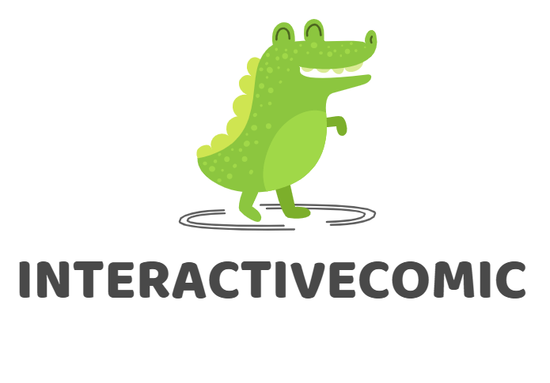
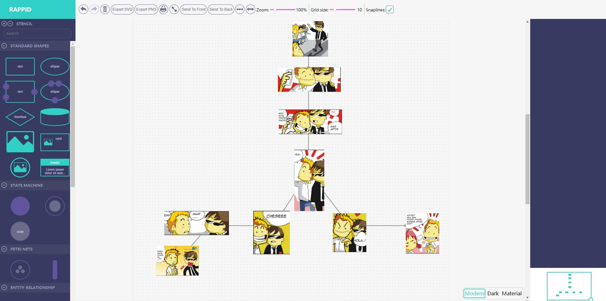

# InteractiveComic

InteractiveComic

<!-- PROJECT SHIELDS -->

[![Contributors][contributors-shield]][contributors-url]
[![Forks][forks-shield]][forks-url]
[![Stargazers][stars-shield]][stars-url]
[![Issues][issues-shield]][issues-url]
[![MIT License][license-shield]][license-url]
[![LinkedIn][linkedin-shield]][linkedin-url]

<!-- PROJECT LOGO -->
<br />

<p align="center">
<p align="center">
  <a href="https://github.com/cauoss4/interactiveComic/">
    
  </a>

  <h3 align="center">"InteractiveComic</h3>
  <p align="center">
    Create your own interactive comics！
    <br />
    <br />
    <a href="https://github.com/shaojintian/Best_README_template">Check Demo</a>
    ·
    <a href="https://github.com/cauoss4/InteractiveComic/issues">Report bug</a>
    ·
  
  </p>

</p>

 
 README.md
 
## List

- [How to use?](#Use)
 
- [File directory description](#File)
- [Framework used](#Framework)
- [License](#License)


## Use
### Live Web APP (Use it in the browser)
index.html
<p align="center">
  <a href="https://github.com/cauoss4/interactiveComic/">
    
  </a>


## File 

```
filetree 
├── README.md
├── LICENSE.txt
├── SSECURITY.md
├── /apps/
├── /css/
├── /build/
├── /dist/
├── /js/
├── /build/
├── /node_modules/
├── index.html
├── placeImage.js
├── interactivecomic.png
└──package.json

```


## Framework used

- [JQUERY](https://jquery.com)
- [JOINTJS](https://www.jointjs.com)


## License


<!-- links -->

[your-project-path]:https://github.com/cauoss4/interactiveComic
[contributors-shield]: https://img.shields.io/github/contributors/cauoss4/interactiveComic.svg?style=flat-square
[contributors-url]: https://github.com/cauoss4/interactiveComic/graphs/contributors
[forks-shield]: https://img.shields.io/github/forks/cauoss4/interactiveComic.svg?style=flat-square
[forks-url]: https://github.com/cauoss4/interactiveComic/network/members
[stars-shield]: https://img.shields.io/github/stars/cauoss4/interactiveComic.svg?style=flat-square
[stars-url]: https://github.com/cauoss4/interactiveComic/stargazers
[issues-shield]: https://img.shields.io/github/issues/cauoss4/interactiveComic.svg?style=flat-square
[issues-url]: https://github.com/cauoss4/interactiveComic.svg
[license-shield]: https://img.shields.io/github/license/cauoss4/interactiveComice.svg?style=flat-square
[license-url]: https://github.com/cauoss4/interactiveComic/LICENSE.txt
[linkedin-shield]:https://img.shields.io/badge/-LinkedIn-black.svg?style=flat-square&logo=linkedin&colorB=555
[linkedin-url]: https://github.com/cauoss4/interactiveComic


